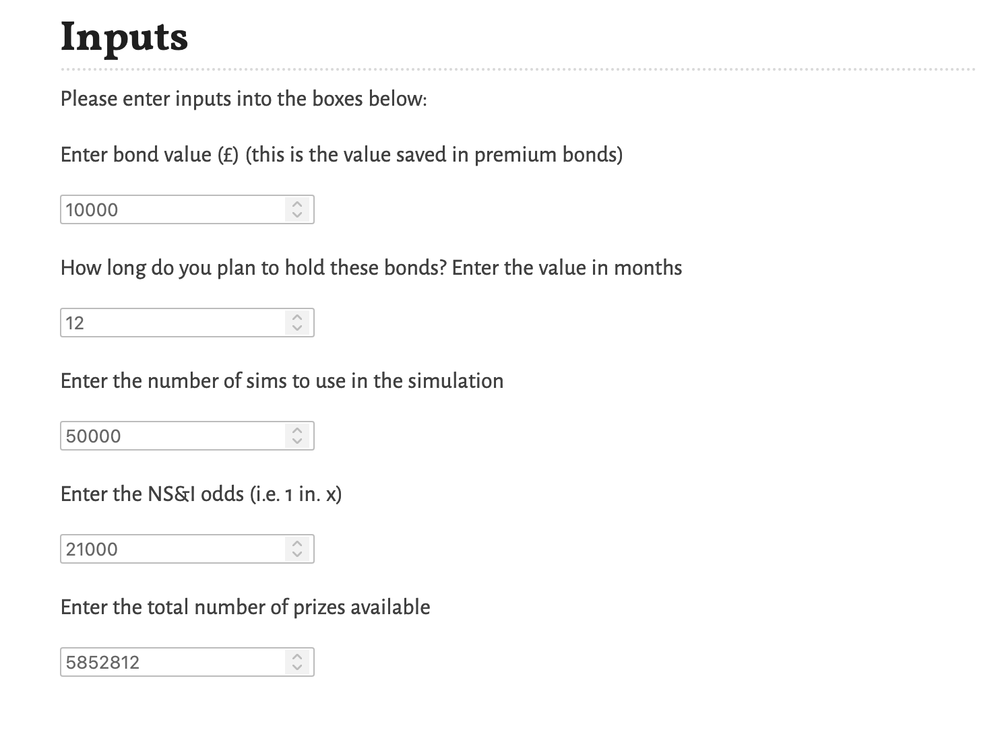
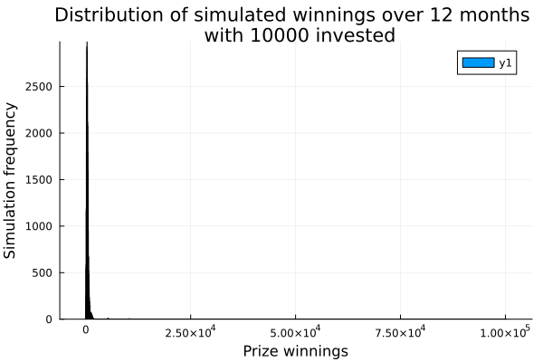
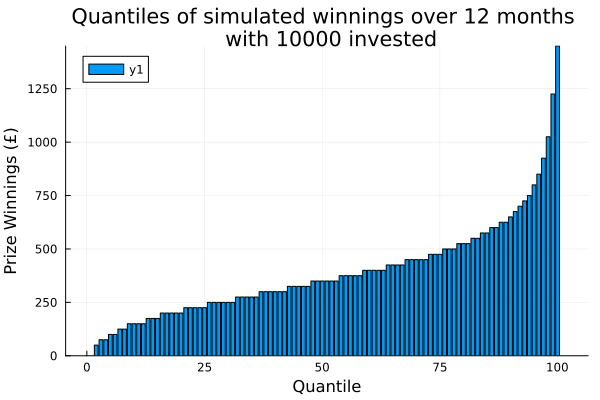

# JuliaPremiumBonds

This project containts a  Pluto notebook to demo how Julia and Pluto can be used to make a basic web app. This notebook simulates the returns on premium bond investments and plots the results (e.g. quantiles of returns over a period).

## Screenshots

The following screenshot shows the inputs into the tool.

The following screenshot shows a histogram of the simulated prize winnings.

The following screenshot shows a bar chart of the quantiles of the simulated prize winnings.

## Limitations

- This calculation assumes that the prize draw odds and distribution of winners stays the same over time. In reality NS&I change the odds and the number of winners based on the interest earned over the period.

- NS&I don't explicitly state how the numbers are drawn, I've assumed they are drawn without replacement (i.e. the same premium bond cannot win multiple prizes). However given the number of premium bonds, it won't make a material dfference.